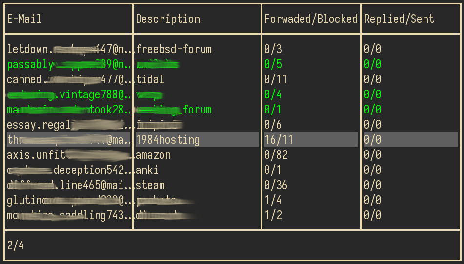

# addytui

[Addy][1] TUI client.

I needed something quick and simple to control aliases from the terminal, so
there it goes. More features coming soon, the ones I need rather than
everything Addy API has to offer.

Based on my [addyapi][2] library.

# PREVIEW



# INSTALL

```bash
go install github.com/kovmir/addytui@latest
```

# USAGE

```bash
export ADDYTUI_TOKEN='your_token'
addycli
```

| Keymap  | Description                            |
|---------|----------------------------------------|
| j, Down | Move selection down                    |
| k, Up   | Move selection up                      |
| d       | Next page                              |
| u       | Previous page                          |
| t       | Toggle (enable/disable) selected alias |
| r       | Re-fetch all alias data                |
| /       | Search                                 |
| Esc     | Cancel search                          |

[1]: https://addy.io/
[2]: https://github.com/kovmir/addyapi
